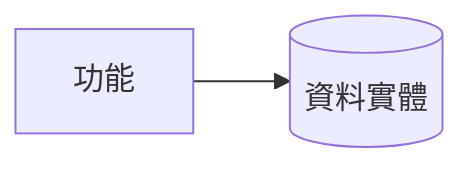

# 模組 SA：{系統}-{模組序} {模組中文名}

> 上游需求：[R00xx](../../PRD/R00xx.md)　｜　下游規格：見各功能 SRS（撰寫後回填）

## §1 流程歸屬

> 本模組功能落在哪條流程線的哪幾步。
> 跨模組流程以**流程線為權威**，此處不重寫；只在「單模組內、未被任何流程線涵蓋的小流程」才在此補。
> 扁平功能型寫「無多步流程」。

- 本模組功能對應 [F1 {流程名}](../flows/F1-{流程名}.md) 的 S2–S3。
- （扁平型範例）本模組為主資料維護，無多步流程。

## §2 模組職責與功能清單

- {一句話：本模組負責什麼}

| 功能編號 | 功能名稱 | 流程步驟 | 對應需求 | 一句話功能說明 |
|---|---|---|---|---|
| {系統}-{模組}-1 | {功能名} | F1-S2 | R00xx | {做什麼} |
| {系統}-{模組}-2 | {功能名} | F1-S3 | R00yy | {做什麼} |
| {系統}-{模組}-3 | {功能名} | —（扁平型） | R00zz | {做什麼} |

> 流程步驟欄填 `F{n}-S{n}`；扁平功能型填 `—`。

## §3 跨功能相依

> 只寫跨功能／跨模組相依。單功能內的頁面流轉屬 UI 行為，寫在 SRS，不列於此。如整段無內容可刪。

### 3.1 上游（本模組依賴誰）

| 上游模組／功能 | 引用什麼資料／權限 | 用途 | 觸發場景 |
|---|---|---|---|
| {模組／功能} | {資料／權限} | {用途} | {何時觸發} |

### 3.2 下游（誰依賴本模組）

| 下游模組／功能 | 取用什麼 | 用途 |
|---|---|---|
| {模組／功能} | {資料} | {用途} |

### 3.3 外部系統（如有，無則整段刪除）

| 外部系統 | 介接方向 | 介接內容 |
|---|---|---|

## §4 資料

### 4.1 主要資料實體

| 實體 | 說明 | 由哪個功能維護 |
|---|---|---|
| {實體} | {說明} | {功能編號} |

### 4.2 資料流（如需要，無則整段刪除）

## §5 追溯

- 上游 PRD 需求：[R00xx](../../PRD/R00xx.md)
- 下游 SRS：各功能 SRS 撰寫後回填；對應總表見 [traceability.md](../../PRD/traceability.md)
