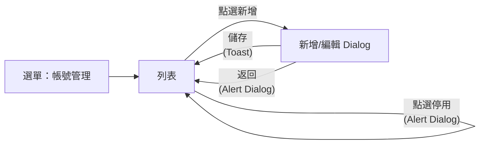

# SRS UI Flow 撰寫指引

> 規範 SRS 頁面規格中「頁內 UI Flow」的撰寫方式與 Mermaid 流程圖畫法。
> **只描述頁內流轉**：本功能頁各區塊／Dialog／子頁之間的進入點、流轉、回退。
> **跨功能流轉屬 SA 流程線**（`SA/flows/`），SRS 不重寫（見 §六）。

---

## 一、位置與結構

頁面 spec 的「## 頁內 UI flow」段，採「條列敘述 ＋ Mermaid 流程圖」：

1. **進入點**：從哪進本功能頁（來源功能編號／選單入口）。
2. **頁內流轉**：各區塊／Dialog 的預設行為、操作如何觸發切換、完成後回退或停留。
3. **流程圖**：Mermaid（畫法見 §四）。

---

## 二、撰寫原則

- 節點＝本頁的**區塊／Dialog／子頁**（如「列表」「新增 Dialog」「FB-1-2-基本資料」）。
- 邊文字＝**觸發動作**（點選新增／編輯／刪除／儲存／返回）。
- 多動作以**粗體流程名稱**分組：

  ```
  2. **新增流程**：列表點「新增」→ 開新增 Dialog → 儲存 → 回列表。
  3. **編輯流程**：列表點「編輯」→ 開編輯 Dialog 帶入該筆。
  4. **刪除流程**：列表點「刪除」→ 彈 Alert Dialog（詳〔共用規則〕§2.1）。
  ```

- **§ 引用**：本頁內章節用 `§X`；其他規則檔用〔規則名〕（如〔共用規則〕§一）。

---

## 三、不寫入 UI Flow 的內容

- 欄位即時驗證、必填／格式檢核（屬欄位規格表／〔共用規則〕表單送出）。
- API／網路錯誤 Toast（〔共用規則〕§三）。
- breadcrumb 點選跳轉（〔功能地圖〕）、Session timeout（〔共用規則〕§六）。
- 同頁 Tab／Step 切換（屬頁面區塊內互動，於該區塊描述）。
- 內嵌型 Dialog 的開啟（見 §五）。
- **跨功能流轉**（屬 SA 流程線，見 §六）。

---

## 四、Mermaid 畫法

- **節點**：`L[列表] D[新增/編輯 Dialog]`，標籤用區塊名。進入點用 `Menu[選單入口]`／`Entry1[來源功能編號<br/>頁名]`。
- **邊文字**＝觸發動作；觸發 Toast／Alert Dialog 時加副作用標記 `<br/>(Toast)`／`<br/>(Alert Dialog)`；**具體措辭不入圖**（由〔共用規則〕統一）。
- **合併邊**：多動作流轉一致 → 以 ` / ` 串接，不畫重複邊。
- **自循環邊**：停留同頁但有狀態變化（彈窗／Toast／列表更新）要畫；純頁內互動不畫。
- **方向**：預設 `flowchart LR`；節點 ≥ 6 改 `flowchart TD`。

範例：



---

## 五、Dialog 在 UI Flow 的角色

- **(a) 內嵌型（預設）**：當前頁情境內的輔助互動（刪除確認、簡易子項）→ 於頁面區塊內以子標題呈現，**不入流程圖節點**。
- **(b) 獨立型**：有獨立進出關係（新增草稿後續編輯、檔案選擇器）→ 以**節點**入流程圖。
- 判斷：僅當前情境內互動採 (a)；有獨立返回／確認／儲存且影響後續流轉採 (b)。

---

## 六、跨功能流轉（不在 SRS）

本功能與其他功能間的流轉（如「發布 → 顯示」）屬**業務流程線**，於 `SA/flows/F*` 定義。SRS 僅在頁面資訊標所屬流程步驟（如 `F1-S1`），**不在 UI Flow 重畫跨功能流程**。
