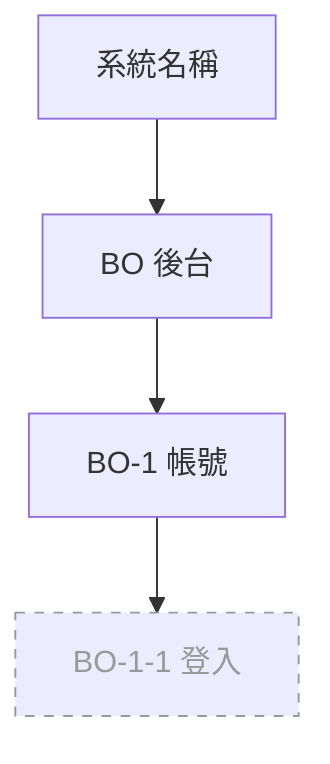

# 功能地圖（Function Tree / Navigation Map）

> SRS 層**導覽權威**：選單階層 ＋ breadcrumb 根。種子取自 SA 功能架構索引（[SA/SA.md](../SA/SA.md)）。
> breadcrumb **由本檔統一定義**（頁面不重寫）；各頁顯示時依本表「breadcrumb 路徑」渲染。
> 涵蓋狀態：✅已產頁 ｜ 🚧本批 ｜ ⬜後續。

## 導覽樹

## 選單階層與 breadcrumb 根

> breadcrumb 根固定為「首頁」。各頁 breadcrumb 取本表「breadcrumb 路徑」欄。

| 功能編號 | 選單群組 | breadcrumb 路徑 | 對應頁面 | 狀態 |
|---|---|---|---|---|
| BO-1-1 | （前置頁，不入選單） | —（登入頁無 breadcrumb） | [BO/BO-1/BO-1-1.md](BO/BO-1/BO-1-1.md)　← 範例 | ⬜後續 |

<!-- 產SRS時：
     1. 依 SA/SA.md 功能架構索引，把系統→模組→功能畫成上方導覽樹。
     2. 為每個功能定選單群組與 breadcrumb 路徑，填入下表；breadcrumb 一律由本檔定義，頁面不重寫。
     3. 本批落地者標 🚧／✅，未到者 ⬜ 佔位。 -->
